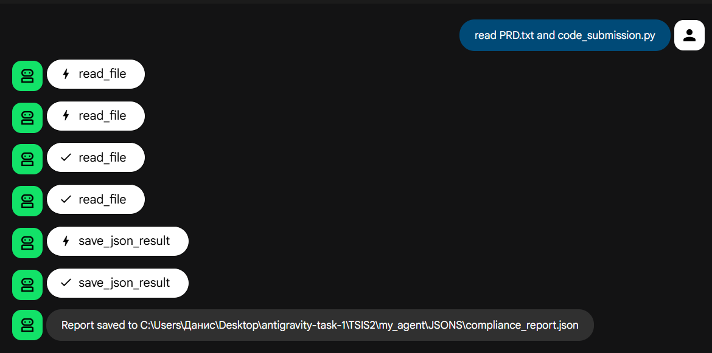

# TSIS 2: AI Code Compliance Auditor - Defense Report

## 1. Objective
**Goal:** Automate the role of a "Code Reviewer" using an AI Agent.
The agent must read a Product Requirements Document (PRD), read a code submission, and judge whether the code meets the requirements and security standards.

**Key constraints:**
*   Output must be structured JSON (for pipelines).
*   Must detect security vulnerabilities.
*   Must fail the submission if compliance < 80%.

## 2. Architecture & Implementation

### The Agent (`agent.py`)
*   **Framework:** Built using Google ADK (`google.adk.agents.llm_agent`).
*   **Model:** Powered by `gemini-2.5-flash` for fast, reasoning-based auditing.
*   **Persona:** "Code Compliance Auditor Agent". Strict, detail-oriented, security-conscious.

### The Tools (`tools.py`)
To make the agent functional, we built two custom tools:
1.  **`read_file(path)`**: A smart file reader that searches multiple directories to find inputs (handling path issues robustly).
2.  **`save_json_result(filename, content)`**: Automatically dumps the audit results into a dedicated `JSONS/` directory for record-keeping.

### The Test Scenario
To prove the agent works, we created a "Trap":
1.  **The Law (`PRD.txt`)**: Requires a robust `AIManager` class with specific error handling (`FileNotFoundError`) and strictly forbids `eval()`.
2.  **The Defendant (`code_submission.py`)**: A class that *looks* correct but contains hidden flaws:
    *   **Security Risk:** Uses `eval(content)` (Critical Fail).
    *   **Compliance Bugs:** Fails to check file existence, handles errors poorly.

## 3. Execution & Results

When the agent runs, it follows this pipeline:
1.  **Ingest:** Reads the PRD and the Python Code.
2.  **Analyze:** Compares the code line-by-line against the text requirements.
3.  **Security Check:** Detects `eval()` as a "Safe/Unsafe" violation.
4.  **Verdict:** Generates a JSON report.

**Outcome:**
The agent successfully identified the flaws and produced a report in `TSIS2/my_agent/JSONS/compliance_report.json`:
*   **Status:** `FAIL`
*   **Security Check:** `Unsafe`
*   **Audit Log:** Correctly flagged the missing specific error handling and the usage of forbidden functions.

## 4. Conclusion
This project demonstrates that GenAI agents can move beyond simple chat to perform **structured, rule-based auditing tasks**. By combining specific instructions, file system tools, and structured outputs, we created an automated gatekeeper for software quality.

1st iteration

2nd iteration

You can view the full compliance report in 2nd iteration [here](./my_agent/JSONS/compliance_report.json).
